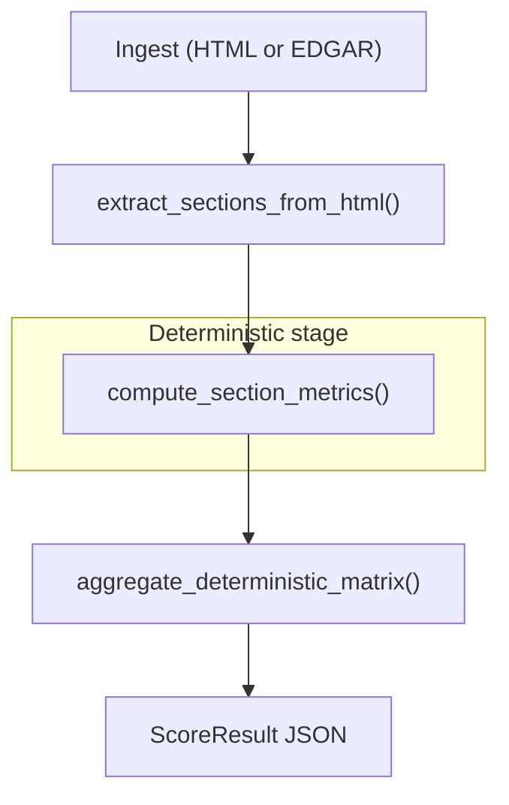

<p align="center">
  
</p>

<p align="center">
  <a href="https://www.python.org/downloads/"></a>
  <a href="https://pypi.org/project/disclosure-alpha/"></a>
  <a href="LICENSE"></a>
  <a href="https://disclosure-alpha.readthedocs.io/en/stable/"></a>
  <a href="https://github.com/alwank/disclosure-alpha/actions/workflows/ci.yml"></a>
</p>

<p align="center">
  Extract sections, measure tone and boilerplate, detect year-over-year changes, and screen peers.<br>
  Deterministic, versioned JSON. <strong>No LLM required</strong>.
</p>

<p align="center">
  <strong><a href="https://disclosure-alpha.readthedocs.io/en/stable/getting-started/index.html">Get started</a></strong>
</p>

## What it is

Open-source, deterministic SEC filing analytics for **10-K, 10-Q, and 8-K** HTML. Reproducible JSON scores from text metrics, boolean risk flags, and section diffs. Self-hosted CLI, Python SDK, HTTP API, and MCP.

## What it is not

- Not investment advice or a trading signal
- Not a substitute for reading the filing
- Not composite LLM scoring (open-source HTTP API is deterministic only; `view=composite` returns 402)

Full scope and limits: [Evidence & limitations](https://disclosure-alpha.readthedocs.io/en/stable/validation/evidence-and-limitations.html).

## Why Disclosure Alpha

Comparing risk-factor and MD&A language across filings, or against a company's prior year, is slow manual work. Disclosure Alpha extracts SEC sections, runs reproducible text metrics and diffs, and returns sortable JSON scores you can wire into notebooks, screeners, or agents. The same deterministic engine powers every integration surface, with version strings in every response for reproducibility.

## What you can do

Disclosure Alpha delivers deterministic scores (nine components, 0-100), section extraction from 10-K/10-Q/8-K HTML, year-over-year change detection, and four integration surfaces ([section taxonomy](https://disclosure-alpha.readthedocs.io/en/stable/reference/section-taxonomy.html)).

| Task | How |
|------|-----|
| Score one company | `disclosure-alpha score --ticker AAPL --fiscal-year 2025 --form 10-K` |
| Screen up to 25 tickers | HTTP `POST /v1/panel/disclosure-matrix` |
| Compare year-over-year | `--prior-html prior.html` or HTTP `compare=prior` |
| Work offline (no EDGAR) | `disclosure-alpha score --html filing.html --form 10-K` |
| Inspect raw signals | `disclosure-alpha metrics …` or `GET /disclosure-metrics` |
| Pull boolean risk flags | `GET /disclosure-flags` |
| Debug section extraction | `disclosure-alpha extract …` or `GET /sections` |

```bash
# Screen a peer set (start disclosure-alpha-api first)
curl -s -X POST "http://localhost:8000/v1/panel/disclosure-matrix" \
  -H "Content-Type: application/json" \
  -d '{"tickers": ["AAPL", "MSFT", "GOOGL"], "fiscal_year": 2025, "form_type": "10-K"}'

# Year-over-year change from local HTML (no network required)
disclosure-alpha score --html current.html --form 10-K --prior-html prior.html

# Raw metrics without headline aggregation
disclosure-alpha metrics --ticker AAPL --fiscal-year 2025 --form 10-K
```

Copy-paste recipes: [Workflows](https://disclosure-alpha.readthedocs.io/en/stable/guides/workflows/index.html).

## How it works

Same pipeline powers every integration surface.



## Score signals

Nine weighted components (0-100; higher = more disclosure risk) feed the headline `overall_disclosure_risk_score`:

| Signal | What it captures |
|--------|------------------|
| Risk-factor intensity | Negative and uncertainty tone in Item 1A |
| Disclosure change | Year-over-year language shift vs prior filing |
| MD&A uncertainty | Demand stress and margin pressure in MD&A |
| Legal / regulatory risk | Investigation and litigation language + flags |
| Liquidity stress | Covenant and cash-flow stress signals |
| Boilerplate | Vague, templated risk language |
| Internal controls | Weakness signals in controls disclosures |
| Event severity | Material changes in risk text (diff-only) |
| Tone negativity | Cross-section negative language |

**Scale:** 0-25 low concern · 26-50 moderate · 51-75 elevated · 76-100 high. Higher = more disclosure risk, except `specificity_quality_score` (higher = more specific).

`specificity_quality_score` is also returned but is excluded from headline weights. Full field guide: [Understanding scores](https://disclosure-alpha.readthedocs.io/en/stable/getting-started/understanding-scores.html).

## Who it's for

| You are… | Start with… |
|----------|-------------|
| Researcher / notebook user | CLI or Python SDK |
| Building a screener or dashboard | HTTP API + Panel |
| Wiring Cursor / Claude | MCP Analyst |
| Custom agent pipeline | MCP Builder |

Not sure? See [Choose your surface](https://disclosure-alpha.readthedocs.io/en/stable/getting-started/choose-your-surface.html).

## Quick start

Requires **Python 3.11+**.

**1. Install from PyPI**

```bash
pip install "disclosure-alpha[dev]"
```

For HTTP API and MCP: `pip install "disclosure-alpha[api,mcp,dev]"`. Full install options: [Installation](https://disclosure-alpha.readthedocs.io/en/stable/getting-started/installation.html).

**2. Set your SEC User-Agent**

```bash
export SEC_USER_AGENT="YourName your@email.com"
```

Required for ticker/EDGAR commands. See [SEC EDGAR setup](https://disclosure-alpha.readthedocs.io/en/stable/getting-started/sec-edgar-setup.html).

**3. Score a filing**

```bash
disclosure-alpha score --ticker AAPL --fiscal-year 2025 --form 10-K \
  | jq '.scores.overall_disclosure_risk_score'
```

```python
from disclosure_alpha import score_filing_ticker
result = score_filing_ticker("AAPL", 2025, form_type="10-K")
print(result.scores.overall_disclosure_risk_score)
```

## Integrate your way

| Surface | Entry | Granularity |
|---------|-------|-------------|
| CLI | `disclosure-alpha` | `extract` → `metrics` → `score` (stepwise or full pipeline) |
| Python | `import disclosure_alpha` | Same pipeline as CLI; compose in notebooks |
| HTTP API | `disclosure-alpha-api` | 8 endpoints: filings, sections, metrics, matrix, flags, changes, panel |
| MCP Analyst | `disclosure-alpha-mcp-analyst` | Ticker discovery + score (2 tools) |
| MCP Builder | `disclosure-alpha-mcp-builder` | Full pipeline as 5 composable tools |

HTTP matrix tiers: `tier=lite` (headline score), `tier=standard` (components + metrics), `tier=analyst` (provenance for audit).

```bash
# Single-ticker dashboard headline (start disclosure-alpha-api first)
curl "http://localhost:8000/v1/company/AAPL/disclosure-matrix?fiscal_year=2025&form_type=10-K&tier=lite"

disclosure-alpha-api              # HTTP on :8000
disclosure-alpha-mcp-analyst      # MCP for Cursor / Claude Desktop
```

Endpoint map, Postman collections (`docs/postman/`), and MCP tool reference: **[Guides](https://disclosure-alpha.readthedocs.io/en/stable/guides/index.html)**.

## MCP in Cursor

Add to your MCP settings (Analyst bundle; requires `pip install "disclosure-alpha[mcp,dev]"`):

```json
{
  "mcpServers": {
    "disclosure-alpha": {
      "command": "disclosure-alpha-mcp-analyst",
      "env": {
        "SEC_USER_AGENT": "YourName your@email.com"
      }
    }
  }
}
```

Full MCP guide: [MCP](https://disclosure-alpha.readthedocs.io/en/stable/guides/mcp/index.html) (Builder bundle for raw HTML pipelines).

## Research-backed

Validated on **~425 S&P 500 FY2025 10-Ks** (~84% of the index):

| Check | Result |
|-------|--------|
| Language quality | Boilerplate and specificity scores correlate with independent text measures (Spearman ρ ~0.68 / ~0.84) |
| Real-world signal | Higher disclosure risk scores associate with higher 90-day post-filing volatility in the same cohort |

Metrics draw on finance text-analysis literature (Loughran-McDonald tone proxies, boilerplate and specificity measures). See [Research foundation](https://disclosure-alpha.readthedocs.io/en/stable/methodology/research-foundation.html).

Research tool, not investment advice. Read the underlying filings. Full scope and limits: **[Evidence & limitations](https://disclosure-alpha.readthedocs.io/en/stable/validation/evidence-and-limitations.html)**.

## Example output

See [Understanding scores](https://disclosure-alpha.readthedocs.io/en/stable/getting-started/understanding-scores.html) for field definitions.

**Single filing score** (synthetic 10-K):

```json
{
  "scores": {
    "overall_disclosure_risk_score": 17.84,
    "score_coverage_ratio": 0.7778,
    "components": {
      "risk_factor_intensity_score": 8.62,
      "boilerplate_risk_score": 42.53,
      "legal_regulatory_risk_score": 25.34
    }
  }
}
```

More examples (YoY change, panel screener): [`docs/examples/`](docs/examples/) and [Workflows](https://disclosure-alpha.readthedocs.io/en/stable/guides/workflows/index.html).

## Documentation

| I want to… | Start here |
|------------|------------|
| Copy-paste recipes | [Workflows](https://disclosure-alpha.readthedocs.io/en/stable/guides/workflows/index.html) |
| Interpret scores | [Understanding scores](https://disclosure-alpha.readthedocs.io/en/stable/getting-started/understanding-scores.html) |
| Score from terminal | [Quickstart CLI](https://disclosure-alpha.readthedocs.io/en/stable/getting-started/quickstart-cli.html) |
| Build a screener | [HTTP guides](https://disclosure-alpha.readthedocs.io/en/stable/guides/http/index.html) |
| Wire an agent | [MCP guide](https://disclosure-alpha.readthedocs.io/en/stable/guides/mcp/index.html) |
| See methodology | [Methodology overview](https://disclosure-alpha.readthedocs.io/en/stable/methodology/overview.html) |

## License

Apache-2.0. See [LICENSE](LICENSE).

## Contributors

See [CONTRIBUTING.md](CONTRIBUTING.md) for development setup, tests, and docs build.
