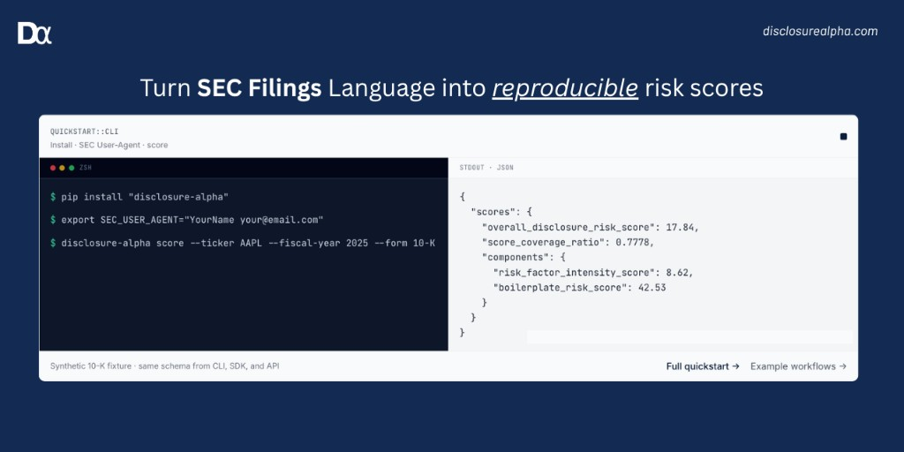

# Disclosure Alpha

<p align="center">
  
</p>

<p align="center">
  <a href="https://www.python.org/downloads/"></a>
  <a href="https://pypi.org/project/disclosure-alpha/"></a>
  <a href="LICENSE"></a>
  <a href="https://readthedocs.org/projects/disclosure-alpha/badge/?version=latest"></a>
  <a href="https://github.com/alwank/disclosure-alpha/actions/workflows/ci.yml"></a>
  <a href="https://github.com/alwank/disclosure-alpha"></a>
</p>

<p align="center">
  Deterministic SEC filing analytics — parse, score, diff. <strong>No LLM required</strong>.<br>
  Extract sections, measure tone and boilerplate, detect year-over-year changes, and screen peers.
</p>

- [Quick start](#quick-start)
- [What it is](#what-it-is)
- [Integration surfaces](#integration-surfaces)
- [Capabilities](#capabilities)
- [Example output](#example-output)
- [Research-backed](#research-backed)
- [MCP in Cursor](#mcp-in-cursor)
- [Documentation](#documentation)

## Quick start

Requires **Python 3.11+**.

**1. Install from PyPI**

```bash
pip install "disclosure-alpha"
```

For HTTP API and MCP: `pip install "disclosure-alpha[api,mcp]"`. Full options: [Installation](https://disclosure-alpha.readthedocs.io/en/latest/getting-started/installation.html).

**2. Set your SEC User-Agent** (required for `--ticker` / EDGAR only; skip for local `--html` scoring)

```bash
export SEC_USER_AGENT="YourName your@email.com"
```

See [SEC EDGAR setup](https://disclosure-alpha.readthedocs.io/en/latest/getting-started/sec-edgar-setup.html).

**3. Score a filing**

```bash
disclosure-alpha score --ticker AAPL --fiscal-year 2025 --form 10-K \
  | jq '.scores.overall_disclosure_risk_score'
```

```python
from disclosure_alpha import score_filing_ticker
result = score_filing_ticker("AAPL", 2025, form_type="10-K")
print(result.scores.overall_disclosure_risk_score)
```

## What it is

Open-source, deterministic SEC filing analytics for **10-K, 10-Q, and 8-K** HTML. Reproducible JSON scores from text metrics, boolean risk flags, and section diffs — one pipeline across CLI, Python SDK, HTTP API, and MCP.

**What it is not:**

- Not investment advice or a trading signal
- Not a substitute for reading the filing
- Not composite LLM scoring (open-source HTTP API is deterministic only; `view=composite` returns 402)

Full scope and limits: [Evidence & limitations](https://disclosure-alpha.readthedocs.io/en/latest/validation/evidence-and-limitations.html).

## Integration surfaces

Five entry points, one deterministic pipeline. Not sure which to pick? See [Choose your surface](https://disclosure-alpha.readthedocs.io/en/latest/getting-started/choose-your-surface.html).

| You are… | Entry | Install extra |
|----------|-------|---------------|
| Terminal / scripts | `disclosure-alpha` | *(base)* |
| Notebooks / apps | `import disclosure_alpha` | *(base)* |
| REST screener or dashboard | `disclosure-alpha-api` | `[api]` |
| Cursor / Claude (ticker scoring) | `disclosure-alpha-mcp-analyst` | `[mcp]` |
| Agent with raw HTML | `disclosure-alpha-mcp-builder` | `[mcp]` |

HTTP matrix tiers: `tier=lite` (headline score), `tier=standard` (components + metrics), `tier=analyst` (provenance for audit).

```bash
disclosure-alpha-api              # HTTP on :8000
disclosure-alpha-mcp-analyst      # MCP for Cursor / Claude Desktop
```

Guides, [Postman collections](https://github.com/alwank/disclosure-alpha/tree/main/docs/postman), and MCP reference: **[Guides](https://disclosure-alpha.readthedocs.io/en/latest/guides/index.html)**.

## Capabilities

Deterministic scores (nine weighted components, 0–100), section extraction, year-over-year change detection. Score scale and component guide: [Understanding scores](https://disclosure-alpha.readthedocs.io/en/latest/getting-started/understanding-scores.html). Section names: [section taxonomy](https://disclosure-alpha.readthedocs.io/en/latest/reference/section-taxonomy.html).

| Task | How |
|------|-----|
| Score one company | `disclosure-alpha score --ticker AAPL --fiscal-year 2025 --form 10-K` |
| Screen up to 25 tickers | HTTP `POST /v1/panel/disclosure-matrix` |
| Compare year-over-year | `--prior-html prior.html` or HTTP `compare=prior` |
| Work offline (no EDGAR) | `disclosure-alpha score --html filing.html --form 10-K` |
| Inspect raw signals | `disclosure-alpha metrics …` or `GET /disclosure-metrics` |
| Pull boolean risk flags | `GET /disclosure-flags` |

```bash
# Screen a peer set (start disclosure-alpha-api first)
curl -s -X POST "http://localhost:8000/v1/panel/disclosure-matrix" \
  -H "Content-Type: application/json" \
  -d '{"tickers": ["AAPL", "MSFT", "GOOGL"], "fiscal_year": 2025, "form_type": "10-K"}'

# Year-over-year from local HTML (no network)
disclosure-alpha score --html current.html --form 10-K --prior-html prior.html
```

Copy-paste recipes: [Workflows](https://disclosure-alpha.readthedocs.io/en/latest/guides/workflows/index.html). Pipeline overview: [Methodology](https://disclosure-alpha.readthedocs.io/en/latest/methodology/overview.html).

## Example output

**Single filing score** (synthetic 10-K):

```json
{
  "scores": {
    "overall_disclosure_risk_score": 17.84,
    "score_coverage_ratio": 0.7778,
    "components": {
      "risk_factor_intensity_score": 8.62,
      "boilerplate_risk_score": 42.53,
      "legal_regulatory_risk_score": 25.34
    }
  },
  "versions": {
    "parser_version": "sec_parser_v1",
    "metrics_engine_version": "text_metrics_v2",
    "dictionary_version": "built_in_dictionaries_v2"
  }
}
```

More examples: [`docs/examples/`](docs/examples/) and [Workflows](https://disclosure-alpha.readthedocs.io/en/latest/guides/workflows/index.html).

## Research-backed

Validated on **~425 S&P 500 FY2025 10-Ks** (~84% of the index):

| Check | Result |
|-------|--------|
| Language quality | Boilerplate and specificity scores correlate with independent text measures (Spearman ρ ~0.68 / ~0.84) |
| Real-world signal | Higher disclosure risk scores associate with higher 90-day post-filing volatility in the same cohort |

Partial L3: volatility association only — **earnings-surprise outcome validation not supported**. Metrics draw on finance text-analysis literature. See [Research foundation](https://disclosure-alpha.readthedocs.io/en/latest/methodology/research-foundation.html) and **[Evidence & limitations](https://disclosure-alpha.readthedocs.io/en/latest/validation/evidence-and-limitations.html)**.

## MCP in Cursor

Requires `pip install "disclosure-alpha[mcp]"`. Add to your MCP settings (Analyst bundle):

```json
{
  "mcpServers": {
    "disclosure-alpha": {
      "command": "disclosure-alpha-mcp-analyst",
      "env": {
        "SEC_USER_AGENT": "YourName your@email.com"
      }
    }
  }
}
```

If Cursor cannot find the command, use the full venv path: `"command": "/path/to/.venv/bin/disclosure-alpha-mcp-analyst"`.

Full MCP guide: [MCP](https://disclosure-alpha.readthedocs.io/en/latest/guides/mcp/index.html) (Builder bundle for raw HTML pipelines).

## Documentation

| I want to… | Start here |
|------------|------------|
| Copy-paste recipes | [Workflows](https://disclosure-alpha.readthedocs.io/en/latest/guides/workflows/index.html) |
| Interpret scores | [Understanding scores](https://disclosure-alpha.readthedocs.io/en/latest/getting-started/understanding-scores.html) |
| Score from terminal | [Quickstart CLI](https://disclosure-alpha.readthedocs.io/en/latest/getting-started/quickstart-cli.html) |
| Build a screener | [HTTP guides](https://disclosure-alpha.readthedocs.io/en/latest/guides/http/index.html) |
| Wire an agent | [MCP guide](https://disclosure-alpha.readthedocs.io/en/latest/guides/mcp/index.html) |
| See methodology | [Methodology overview](https://disclosure-alpha.readthedocs.io/en/latest/methodology/overview.html) |

## License

Apache-2.0. See [LICENSE](LICENSE). [Changelog](https://github.com/alwank/disclosure-alpha/blob/main/docs/appendix/changelog.md) · [Releases](https://github.com/alwank/disclosure-alpha/releases)

## Contributors

See [CONTRIBUTING.md](CONTRIBUTING.md) for development setup, tests, and docs build. Report security issues via [SECURITY.md](SECURITY.md).
