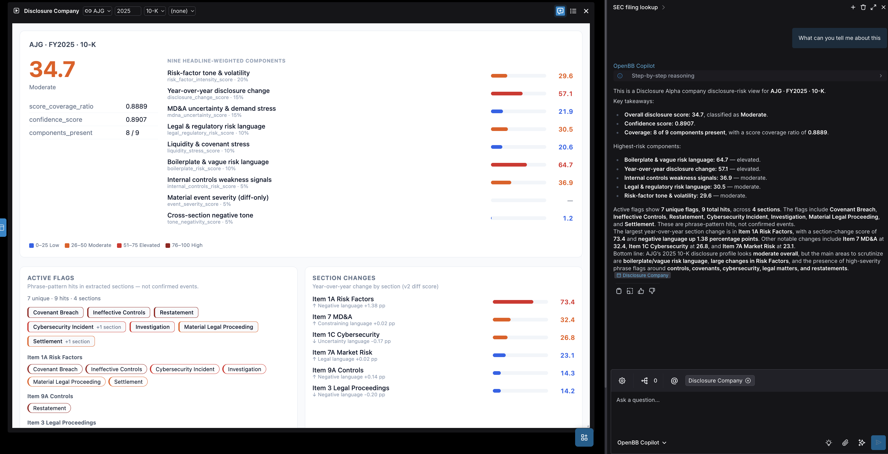

# Disclosure Alpha

<p align="center">
  
</p>

<p align="center">
  <a href="https://www.python.org/downloads/"></a>
  <a href="https://pypi.org/project/disclosure-alpha/"></a>
  <a href="LICENSE"></a>
  <a href="https://readthedocs.org/projects/disclosure-alpha/badge/?version=latest"></a>
  <a href="https://github.com/alwank/disclosure-alpha/actions/workflows/ci.yml"></a>
  <a href="https://disclosure-alpha.readthedocs.io/en/latest/getting-started/evidence.html"></a>
  <a href="https://github.com/alwank/disclosure-alpha"></a>
</p>

<p align="center">
  Deterministic SEC filing analytics — parse, score, diff. <strong>No LLM required</strong>.<br>
  Extract sections, measure tone and boilerplate, detect year-over-year changes, and screen peers.
</p>

- [Quick start](#quick-start)
- [What it is](#what-it-is)
- [Integration surfaces](#integration-surfaces)
- [OpenBB Workspace](#openbb-workspace)
- [Capabilities](#capabilities)
- [Example output](#example-output)
- [Research-backed](#research-backed)
- [Documentation](#documentation)

## Quick start

Requires **Python 3.11+**.

**1. Install from PyPI**

```bash
pip install "disclosure-alpha"
```

For HTTP API and MCP: `pip install "disclosure-alpha[api,mcp]"`. Full options: [Installation](https://disclosure-alpha.readthedocs.io/en/latest/getting-started/installation.html).

**2. Set your SEC User-Agent** (required for `--ticker` / EDGAR only; skip for local `--html` scoring)

```bash
export SEC_USER_AGENT="YourName your@email.com"
```

See [SEC EDGAR setup](https://disclosure-alpha.readthedocs.io/en/latest/getting-started/sec-edgar-setup.html).

**3. Score a filing**

```bash
disclosure-alpha score --ticker AAPL --fiscal-year 2025 --form 10-K \
  | jq '.scores.overall_disclosure_risk_score'
```

```python
from disclosure_alpha import score_filing_ticker
result = score_filing_ticker("AAPL", 2025, form_type="10-K")
print(result.scores.overall_disclosure_risk_score)
```

## What it is

Open-source, deterministic SEC filing analytics for **10-K and 10-Q** HTML. Reproducible JSON scores from text metrics, boolean risk flags, and section diffs — one pipeline across CLI, Python SDK, HTTP API, OpenBB Workspace, and MCP. **8-K** is supported via local `--html` or the MCP Builder bundle only (not `--ticker`, EDGAR, or HTTP ticker routes).

**What it is not:**

- Not investment advice or a trading signal
- Not a substitute for reading the filing

Full scope and limits: [Scope and claims](https://disclosure-alpha.readthedocs.io/en/latest/getting-started/scope-and-claims.html).

## Integration surfaces

Six entry points, one deterministic pipeline. Not sure which to pick? See [Choose your surface](https://disclosure-alpha.readthedocs.io/en/latest/getting-started/choose-your-surface.html).

| You are… | Entry | Install extra |
|----------|-------|---------------|
| Terminal / scripts | `disclosure-alpha` | *(base)* |
| Notebooks / apps | `import disclosure_alpha` | *(base)* |
| REST screener or dashboard | `disclosure-alpha-api` | `[api]` |
| OpenBB Workspace analyst | `disclosure-alpha-api` + [OpenBB guide](https://disclosure-alpha.readthedocs.io/en/latest/guides/openbb/index.html) | `[api,mcp]` |
| AI agent (ticker scoring) | `disclosure-alpha-mcp-analyst` | `[mcp]` |
| Agent with raw HTML | `disclosure-alpha-mcp-builder` | `[mcp]` |

HTTP matrix tiers apply to **single-ticker GET** `GET /v1/company/{ticker}/disclosure-matrix` only: `tier=lite` (headline score), `tier=standard` (components + metrics), `tier=analyst` (provenance for audit). Panel `POST /v1/panel/disclosure-matrix` has no `tier` param — use `include` / `fields`. See [HTTP guides](https://disclosure-alpha.readthedocs.io/en/latest/guides/http/index.html).

```bash
disclosure-alpha-api              # HTTP + OpenBB Workspace backend on :8000
disclosure-alpha-mcp-analyst      # MCP analyst bundle
```

Guides, [Postman collections](https://github.com/alwank/disclosure-alpha/tree/main/docs/postman), and MCP reference: **[Guides](https://disclosure-alpha.readthedocs.io/en/latest/guides/index.html)**.

## OpenBB Workspace

Score filings in [OpenBB Workspace](https://pro.openbb.co) with a self-hosted backend — overall score, components, active flags, and section changes in one widget.

```bash
pip install "disclosure-alpha[api,mcp]"
export SEC_USER_AGENT="YourName your@email.com"
disclosure-alpha-api
```

In Workspace: **Apps → Connect backend** → `http://127.0.0.1:8000` → **My Apps → Disclosure Alpha → Company** → **Run**. Connect **Disclosure Alpha Analyst** MCP from the app page for Copilot scoring tools.

<p align="center">
  
</p>

OpenBB Copilot can summarize the widget; that is an OpenBB feature, not part of Disclosure Alpha.

Quickstart: [OpenBB Workspace](https://disclosure-alpha.readthedocs.io/en/latest/getting-started/quickstart-openbb.html) · Full guide: [OpenBB guide](https://disclosure-alpha.readthedocs.io/en/latest/guides/openbb/index.html)

## Capabilities

Deterministic scores — ten computed components (nine headline-weighted, 0–100), section extraction, year-over-year change detection. Canonical component list: [Score catalog](https://disclosure-alpha.readthedocs.io/en/latest/reference/score-catalog.html). Score scale: [Understanding scores](https://disclosure-alpha.readthedocs.io/en/latest/getting-started/understanding-scores.html).

| Task | How |
|------|-----|
| Score one company | `disclosure-alpha score --ticker AAPL --fiscal-year 2025 --form 10-K` |
| Score in OpenBB Workspace | `disclosure-alpha-api` + Workspace connect → [OpenBB quickstart](https://disclosure-alpha.readthedocs.io/en/latest/getting-started/quickstart-openbb.html) |
| Screen up to 25 tickers | HTTP `POST /v1/panel/disclosure-matrix` (no `tier`; use `include` / `fields`) |
| Compare year-over-year | `--prior-html prior.html` or HTTP `compare=prior` |
| Work offline (no EDGAR) | `disclosure-alpha score --html filing.html --form 10-K` |
| Inspect raw signals | `disclosure-alpha metrics …` or `GET /disclosure-metrics` |
| Pull boolean risk flags | `GET /disclosure-flags` |

```bash
# Screen a peer set (start disclosure-alpha-api first)
curl -s -X POST "http://localhost:8000/v1/panel/disclosure-matrix" \
  -H "Content-Type: application/json" \
  -d '{"tickers": ["AAPL", "MSFT", "GOOGL"], "fiscal_year": 2025, "form_type": "10-K"}'

# Year-over-year from local HTML (no network)
disclosure-alpha score --html current.html --form 10-K --prior-html prior.html
```

Copy-paste recipes: [Workflows](https://disclosure-alpha.readthedocs.io/en/latest/guides/workflows/index.html). Pipeline overview: [Methodology](https://disclosure-alpha.readthedocs.io/en/latest/methodology/overview.html).

## Example output

**Single filing score** (synthetic 10-K):

```json
{
  "scores": {
    "overall_disclosure_risk_score": 17.84,
    "score_coverage_ratio": 0.7778,
    "components": {
      "risk_factor_intensity_score": 8.62,
      "boilerplate_risk_score": 42.53,
      "legal_regulatory_risk_score": 25.34
    }
  },
  "versions": {
    "parser_version": "section_extractor_v1",
    "metrics_engine_version": "text_metrics_v4",
    "dictionary_version": "built_in_dictionaries_v3",
    "scoring_model_version": "deterministic_scoring_v2",
    "analytics_config_id": "builtin_default"
  }
}
```

More examples: [Examples gallery](https://disclosure-alpha.readthedocs.io/en/latest/examples/index.html) and [Workflows](https://disclosure-alpha.readthedocs.io/en/latest/guides/workflows/index.html).

## Research-backed

S&P 500 FY2025 **Item 1A** · `deterministic_scoring_v2` · [full evidence →](https://disclosure-alpha.readthedocs.io/en/latest/getting-started/evidence.html)

| Check | Result |
|-------|--------|
| Analysis cohort | **478** firms (503-name universe) |
| Specificity vs NER | Spearman **ρ ≈ 0.87** (n=478) |
| Boilerplate vs LS4-gram proxy | Spearman **ρ ≈ 0.92** (n=478) |
| Post-filing vol (90d) | Q5/Q1 **≈ 1.15** (n=435) |

Construct checks use independent references. Vol association is descriptive only — **not** investment advice or alpha. Scope: [Scope and claims](https://disclosure-alpha.readthedocs.io/en/latest/getting-started/scope-and-claims.html).

## Documentation

| I want to… | Start here |
|------------|------------|
| Prove it works in five minutes | [First successful run](https://disclosure-alpha.readthedocs.io/en/latest/getting-started/first-successful-run.html) |
| Evaluate whether to trust this | [Evidence and validation](https://disclosure-alpha.readthedocs.io/en/latest/getting-started/evidence.html) |
| Understand the numbers | [Understanding scores](https://disclosure-alpha.readthedocs.io/en/latest/getting-started/understanding-scores.html) |
| Score in terminal | [Quickstart CLI](https://disclosure-alpha.readthedocs.io/en/latest/getting-started/quickstart-cli.html) |
| Build a screener | [HTTP guides](https://disclosure-alpha.readthedocs.io/en/latest/guides/http/index.html) → [Workflows](https://disclosure-alpha.readthedocs.io/en/latest/guides/workflows/index.html) |
| Use in Python | [Quickstart Python](https://disclosure-alpha.readthedocs.io/en/latest/getting-started/quickstart-python.html) |
| Score in OpenBB Workspace | [Quickstart OpenBB](https://disclosure-alpha.readthedocs.io/en/latest/getting-started/quickstart-openbb.html) |
| Copy-paste examples | [Examples gallery](https://disclosure-alpha.readthedocs.io/en/latest/examples/index.html) |

## License

Apache-2.0. See [LICENSE](LICENSE). [Changelog](https://github.com/alwank/disclosure-alpha/blob/main/docs/appendix/changelog.md) · [Releases](https://github.com/alwank/disclosure-alpha/releases)

## Contributors

See [CONTRIBUTING.md](CONTRIBUTING.md) for development setup, tests, and docs build. Report security issues via [SECURITY.md](SECURITY.md).
