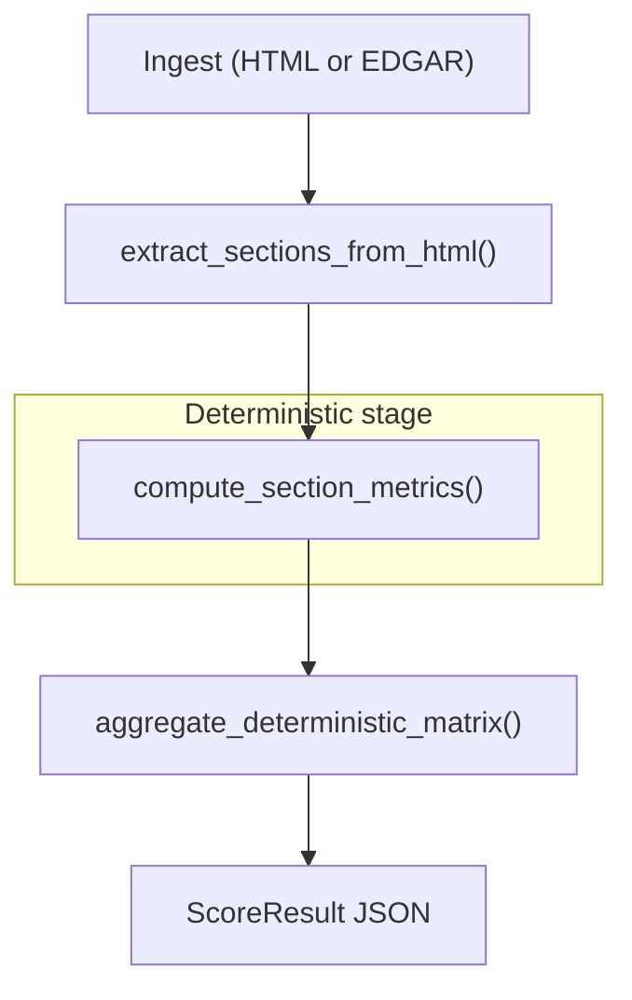

Text equivalent:

```text
ingest (HTML or EDGAR)
    ↓
extract sections (Item 1A, MD&A, …)
    ↓
deterministic stage
  • text metrics (tone, boilerplate, specificity, …)
  • boolean risk flags
  • section diffs vs prior comparable filing
    ↓
aggregate
  • 9 weighted component scores (0–100)
  • overall disclosure risk score + confidence
```
