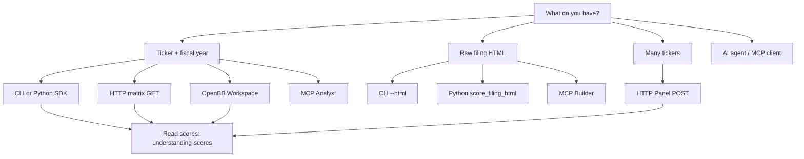

# Choose Your Surface

Disclosure Alpha exposes the same deterministic pipeline through a CLI, Python SDK, focused HTTP endpoints, and two MCP bundles — pick the surface that matches your workflow.

## Which surface?

Need help reading the JSON? Start with {doc}`understanding-scores`.

## Personas

| Persona | Need | Surface |
|---------|------|---------|
| Discovery / data engineer | List filings, extract sections | Filing Index + Section Extractor (HTTP) |
| Quant / researcher | Raw metrics, flags, diffs | Disclosure Analytics, Flags, Changes (HTTP) |
| Risk analyst | Filing-level scores | Disclosure Risk Score / matrix (HTTP) |
| Screener / index builder | Batch tickers | Panel POST (HTTP) |
| OpenBB Workspace dashboard | Interactive disclosure app | OpenBB backend + {doc}`../guides/openbb/index` |
| Agent builder | Low-level pipeline in MCP | Builder MCP bundle |
| Agent user | Ticker score + filings | Analyst MCP bundle |
| Script / notebook | One-off scoring | CLI or Python SDK |

## Quick comparison

| Surface | Best for | Entry point |
|---------|----------|-------------|
| CLI | Terminal workflows, local HTML | `disclosure-alpha` |
| Python SDK | Custom pipelines, notebooks | `import disclosure_alpha` |
| HTTP API | Services, dashboards, screeners | `disclosure-alpha-api` |
| OpenBB Workspace | Analyst dashboards in OpenBB | `disclosure-alpha-api` + {doc}`../guides/openbb/index` |
| MCP Analyst | AI agent ticker tools | `disclosure-alpha-mcp-analyst` |
| MCP Builder | Raw HTML agent workflows | `disclosure-alpha-mcp-builder` |

## MCP bundles

| Entry point | Tools | Resource |
|-------------|-------|----------|
| `disclosure-alpha-mcp-analyst` | `list_company_filings_tool`, `score_company_filing_tool` | `disclosure://taxonomy/v1` |
| `disclosure-alpha-mcp-builder` | `extract_sections_tool`, `compute_section_metrics_tool_wrapper`, `diff_sections_tool`, `score_deterministic_tool_wrapper`, `score_filing_html_tool_wrapper` | — |

Legacy `disclosure-alpha-mcp` aliases to the analyst bundle.

## Related

- {doc}`understanding-scores` — interpret score JSON
- {doc}`../guides/http/index` — endpoint map, tiers, Postman collections
- {doc}`../guides/openbb/index` — OpenBB Workspace backend
- {doc}`../guides/mcp/index`
- {doc}`../guides/cli/index`
- {doc}`../guides/python/index`
- {doc}`../methodology/overview`
