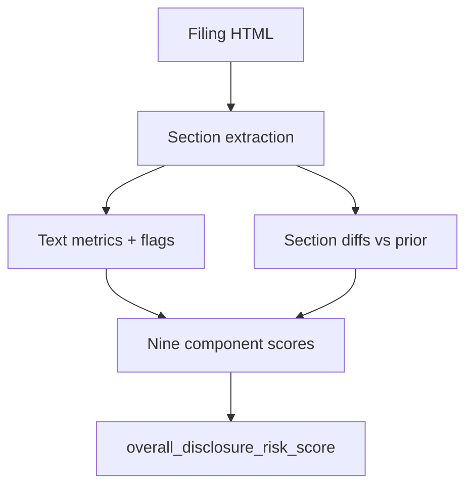

# Understanding Scores

**Audience:** Anyone interpreting CLI, Python, or HTTP score JSON for the first time.
**Before you start:** Skim {doc}`concepts` for pipeline vocabulary.

## Summary

How to read Disclosure Alpha's 0–100 disclosure risk scores, component fields, and coverage signals.

## In plain terms

Disclosure Alpha compares filing language patterns and year-over-year section changes to produce reproducible risk scores — no LLM required. The headline number is a weighted blend of nine component scores; lower coverage or missing prior filings show up as null components and a lower `score_coverage_ratio`.

## Problem framing

You want to compare a company's disclosure language against its prior filing — or against a peer screen — without hand-reading every risk-factor paragraph. Disclosure Alpha extracts Item 1A, MD&A, and other sections, runs deterministic text metrics and diffs, and returns a single JSON object you can sort, filter, or wire into dashboards.

## Score anatomy



```{include} ../_includes/pipeline-diagram.md
```

## Reading a response

The sample below comes from a minimal synthetic 10-K with no prior filing. Section text is trimmed in the committed fixture; full structure: [`score-minimal-10k.json`](../examples/score-minimal-10k.json).

```{literalinclude} ../examples/score-minimal-10k.json
:language: json
:lines: 124-151
```

### Headline fields

- **`overall_disclosure_risk_score`** (~18 here) — weighted mean of present headline components. On the scale below, this filing is low concern.
- **`score_coverage_ratio`** (0.78) — seven of nine headline components computed. Names in `missing_components` were not computed.
- **`confidence_score`** (0.44) — lower here because extraction confidence is weak on a tiny synthetic filing and there is no prior for change diffs.

### Top components in this example

- **`legal_regulatory_risk_score`** (25.3) — litigious tone in Item 1A plus an investigation flag.
- **`boilerplate_risk_score`** (42.5) — moderate vague-language signal relative to other components.
- **`mdna_uncertainty_score`** (26.7) — uncertainty language and margin-pressure density in MD&A.

`disclosure_change_score` and `event_severity_score` are **null** because no prior filing was supplied — that means missing, not zero change.

When a prior filing is available, the scores block looks like this (abbreviated):

```{literalinclude} ../examples/score-with-prior-snippet.json
:language: json
```

Here `disclosure_change_score` is present (46.9) and coverage rises to 0.78 with only MD&A-related gaps.

## Component guide

```{include} ../_includes/component-plain-english.md
```

## Score scale

```{include} ../_includes/score-scale.md
```

## Low coverage and null components

When required sections fail to extract or there is no prior comparable filing:

- Affected components appear as **`null`** in `components` (never substituted with zero).
- **`missing_components`** lists component names that could not be computed.
- **`score_coverage_ratio`** drops; the headline score renormalizes over present components only.

See {doc}`faq` for troubleshooting low coverage and null change scores.

## Related

- {doc}`concepts` — pipeline vocabulary
- {doc}`../methodology/overview` — full specification
- {doc}`../validation/evidence-and-limitations` — supported claims
- {doc}`../appendix/glossary` — terms and artifact versions
